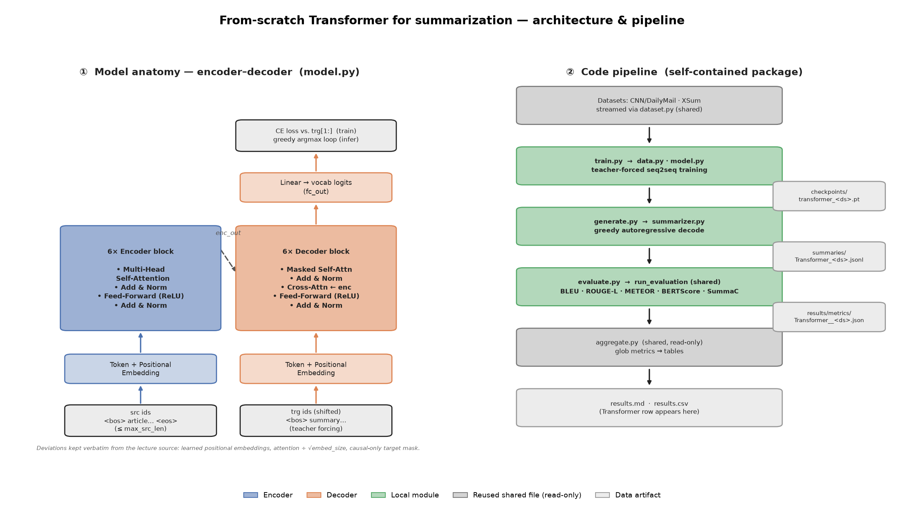

# From-Scratch Encoder-Decoder Transformer for News Summarization

An encoder-decoder Transformer with randomly initialized weights, trained from
scratch on CNN/DailyMail and XSum and scored on the full test splits with the
project's shared evaluator. No pretrained weights are used; only the GPT-2 BPE
tokenizer is reused, so the model does not also have to learn a vocabulary.

One checkpoint is trained per dataset — the two summary styles differ too much
to share weights — and both are labelled `Transformer` in the results, since the
dataset is already part of every output filename.

---

## Architecture

| | |
|---|---|
| Embedding size | 256 |
| Layers | 6 encoder + 6 decoder |
| Attention heads | 8 |
| Feed-forward expansion | 4 |
| Dropout | 0.1 |
| Positional encoding | learned `nn.Embedding(max_length, embed_size)` |
| Max positions | 400 |
| Vocabulary | GPT-2 BPE + `<pad>` `<bos>` `<eos>` = 50,260 |
| Parameters | 46,416,468 |

Attention is scaled by √`embed_size` rather than √`head_dim`, and the decoder
mask is causal only — padded target positions are excluded from the loss through
`ignore_index` instead of from attention.

## Data and training

The article is BPE-tokenized and truncated to `max_src_len` = 400 tokens, which
is the cap the learned positional table imposes. The reference summary is the
target, capped at `max_trg_len` = 64. Training is teacher-forced: the decoder
reads `trg[:, :-1]` and predicts `trg[:, 1:]` under cross-entropy that ignores
`<pad>`. Train splits are streamed with a buffered shuffle (287,113
CNN/DailyMail and 204,017 XSum pairs).

AdamW (betas 0.9/0.98, weight decay 1e-4), ~4k-step linear warmup to lr 3e-4
then inverse-sqrt decay, gradient clipping at 1.0, AMP mixed precision, and a
step budget of 50k with the best checkpoint chosen by validation loss and early
stopping.

| | CNN/DailyMail | XSum |
|---|---|---|
| Best step | 16,000 (early stop) | 50,000 (full budget) |
| Validation loss | 6.6056 | 5.8227 |

Inference is greedy autoregressive decoding from `<bos>` until `<eos>`.



## Results

Full test splits, no sampling: 11,490 CNN/DailyMail and 11,334 XSum documents.

| | CNN/DailyMail | XSum |
|---|---|---|
| ROUGE-L | 0.1033 | 0.1430 |
| BLEU | 0.0050 | 0.0140 |
| METEOR | 0.0851 | 0.1383 |
| BERTScore-F1 | 0.8008 | 0.8482 |
| SummaC | 0.5604 | 0.3685 |
| words generated | 45.3 | 23.9 |
| words in reference | 52.9 | 21.7 |
| sentences generated | 6.34 | 1.20 |

Length is well matched on both datasets, so the gap is in content rather than in
output budget. Ten sampled article/reference/generated triples per dataset are
under `results/examples/`; the full generated summaries are in
`results/summaries/` as `{idx, generated_summary}` JSONL, gzipped, in test-split
order.

## Layout

```
scratch_transformer/
  model.py        encoder-decoder architecture
  data.py         GPT-2 tokenizer, batching, train/val split loading
  train.py        teacher-forced training, one checkpoint per dataset
  generate.py     greedy generation -> summaries/Transformer_<dataset>_summaries.jsonl
  evaluate.py     scoring -> results/metrics/Transformer__<dataset>.json
  summarizer.py   greedy decode wrapper used at generation time
  architecture_diagram.py, architecture.png
  slurm/          train, generate, evaluate and submit-all scripts
dataset.py, pipeline_config.py, evaluator.py, run_evaluation.py, aggregate.py
                  shared pipeline code, imported read-only
results/          metrics, model metadata, tables, charts, summaries, examples
```

Checkpoints (`*.pt`) are gitignored and produced at run time.

## Running

```bash
pip install -r requirements.txt

python -m scratch_transformer.train --dataset_index 0
python -m scratch_transformer.generate
python -m scratch_transformer.evaluate
python aggregate.py
```

`--dataset_index` is 0 for CNN/DailyMail and 1 for XSum. On SLURM the whole
chain — train (GPU array over both datasets), generate, evaluate, aggregate — is
submitted with:

```bash
bash scratch_transformer/slurm/submit_transformer.sh
```

A local smoke test on CPU:

```bash
python -m scratch_transformer.train --dataset_index 0 --sample 200 --max_steps 20 \
    --max_src_len 128 --max_trg_len 32 --batch_size 4 --val_size 20 --device cpu
python -m scratch_transformer.generate --sample 20
python -m scratch_transformer.evaluate --sample 20
python aggregate.py
```
