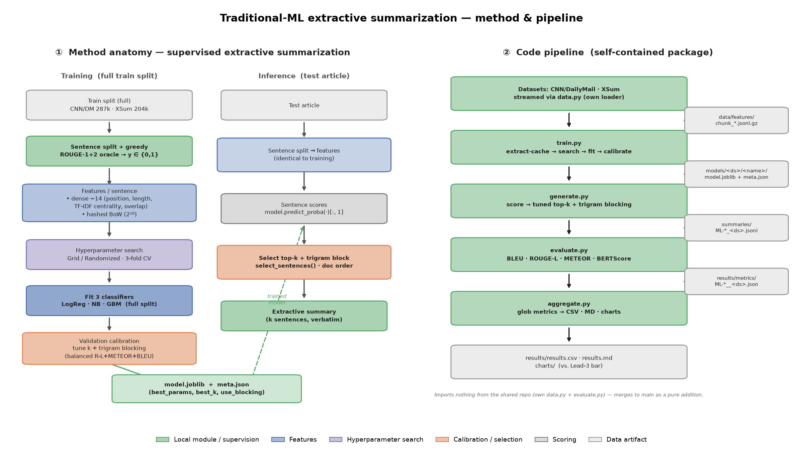

# Extractive News Summarization with Classical Machine Learning

Sentence-classification approach to extractive summarization on CNN/DailyMail
and XSum. Three classifiers — logistic regression, multinomial naive Bayes and
XGBoost — score every sentence of an article; the highest-scoring sentences,
subject to a redundancy constraint, form the summary. No text is generated: the
output is a subset of the input sentences.

On CNN/DailyMail, XGBoost and logistic regression both exceed the Lead-3
baseline (ROUGE-L 0.2605 and 0.2604 against 0.2428). All three exceed Lead-3 on
XSum. Training and inference are CPU-only.

---

## Method and pipeline



**1. Segmentation.** NLTK `punkt`, which preserves abbreviations such as *U.S.*
and *Dr.* A regex fallback exists but degrades segmentation materially.

**2. Oracle labelling.** Sentence labels are induced from the reference summary
by greedy maximisation of the mean of ROUGE-1 and ROUGE-2 F1, adding sentences
until no further gain is possible. Selection is set-level, not per-sentence
thresholding. The resulting positive rate is ≈8.5%.

**3. Features.** Fourteen dense features per sentence: positional (`rel_pos`,
`is_first`, `in_first_3`), length (`word_norm`, `len_vs_mean`), centrality
(`tfidf_centroid_cos`, `unigram_overlap_rest`), surface statistics (numeral,
capital, quote and stopword ratios) and two document-level terms. All are
normalised per document and bounded to [0, 1]. Logistic regression and naive
Bayes additionally consume a hashed bag-of-words block (2¹⁸ features, 1–2 grams);
XGBoost uses the dense features only.

**4. Classification.** Balanced class weights address the ≈1:11 imbalance.
Hyperparameters are selected by `average_precision`, which is appropriate for
ranking under imbalance; accuracy is not used. Linear and naive Bayes models are
fitted out-of-core by `partial_fit`; XGBoost is fitted full-batch on the dense
matrix.

**5. Selection.** Sentences are ranked by predicted probability and selected
either as top-*k* or against a word budget, with redundancy controlled by
maximal marginal relevance or trigram blocking. The length × redundancy grid is
swept on the validation split and the winner stored per model.

**6. Ordering.** Selected sentences are restored to document order before
scoring.

Training proceeds in four resumable phases — feature extraction with caching,
hyperparameter search, full-split fit, and selection-policy calibration:

```bash
pip install -r requirements.txt
python -c "import nltk; [nltk.download(p) for p in ('punkt_tab','wordnet','omw-1.4')]"

python -m traditional_ml.train    --dataset xsum --models logreg \
                                  --sample 200 --val_docs 40 --hparam_subsample 2000 --force
python -m traditional_ml.generate --model logreg --datasets xsum --sample 30
python -m traditional_ml.evaluate --models logreg --datasets xsum --no_bertscore
python -m traditional_ml.aggregate
```

Run from the repository root. The three scale flags are required for a reduced
run: `--sample` bounds only feature extraction, while calibration is governed by
`--val_docs`, which defaults to the complete validation split. `run_all` without
arguments reproduces the full configuration below (491,158 training documents,
≈14.1M labelled sentences).

---

## Results

Full test splits: 11,490 CNN/DailyMail and 11,334 XSum documents, no sampling.

### CNN/DailyMail

| Model | ROUGE-L | BLEU | METEOR | BERTScore-F1 | Length |
|---|---|---|---|---|---|
| ML-XGB | **0.2605** | 0.1309 | **0.3934** | 0.8724 | 73.1 |
| ML-LogReg | **0.2604** | **0.1350** | 0.3899 | 0.8727 | 70.4 |
| ML-NB | 0.2262 | 0.0997 | 0.3510 | 0.8626 | 80.7 |
| *Lead-3* | *0.2428* | *0.1150* | *0.3854* | *0.8691* | *82.2* |

### XSum

| Model | ROUGE-L | BLEU | METEOR | BERTScore-F1 | Length |
|---|---|---|---|---|---|
| ML-LogReg | **0.1400** | **0.0136** | **0.2013** | **0.8586** | 39.0 |
| ML-XGB | 0.1348 | 0.0124 | 0.1890 | 0.8584 | 36.4 |
| ML-NB | 0.1280 | 0.0110 | 0.1940 | 0.8541 | 44.9 |
| *Lead-3* | *0.1155* | *0.0077* | *0.2089* | *0.8546* | *69.4* |


### Selected configurations

| Dataset | Model | Hyperparameters | Selection policy | CV AP |
|---|---|---|---|---|
| CNN/DM | ML-XGB | `n_estimators=400, max_depth=8, lr=0.05, subsample=0.8` | top-3, MMR λ=0.3 | 0.2594 |
| CNN/DM | ML-LogReg | `alpha=1e-05, penalty=l2` | top-3, MMR λ=0.5 | 0.2488 |
| CNN/DM | ML-NB | `alpha=1.0` | top-3, MMR λ=0.7 | 0.1821 |
| XSum | ML-LogReg | `alpha=1e-05, penalty=l2` | top-2, MMR λ=0.7 | 0.2459 |
| XSum | ML-XGB | `n_estimators=200, max_depth=8, lr=0.05, subsample=0.8` | top-2, MMR λ=0.7 | 0.2332 |
| XSum | ML-NB | `alpha=0.1` | top-2, MMR λ=0.5 | 0.1633 |

All six models selected MMR over plain top-*k*, indicating that redundancy
control contributes materially once calibrated on the full validation split.

The difference between XGBoost and logistic regression on CNN/DailyMail (0.2605
vs 0.2604) is within noise and should be read as a tie; XGBoost leads on METEOR,
logistic regression on BLEU and on XSum overall. XGBoost selected boundary values
for `max_depth` (8) and, on CNN/DailyMail, `n_estimators` (400), so a wider grid
may yield further gains. SummaC and QAFactEval were excluded as unreliable:
identical models under different quantization produced scores from 0.29 to 0.97.

---

## Generated summaries against references

Three cases from ML-XGB, with the source article, the reference, and the system
output, for sanity checking.

### 1. CNN/DailyMail — successful extraction

**Article.** Arsenal, Newcastle United and Southampton have checked on Caen
midfielder N'golo Kante. Paris-born Kante is a defensive minded player who has
impressed for Caen this season and they are willing to sell for around
£5million. Marseille have been in constant contact with Caen over signing the
24-year-old who has similarities with Lassana Diarra and Claude Makelele in
terms of stature and style. N'Golo Kante is attracting interest from a host of
Premier League clubs including Arsenal. Caen would be willing to sell Kante for
around £5million.

**Reference.** N'golo Kante is wanted by Arsenal, Newcastle and Southampton.
Marseille are also keen on the £5m rated midfielder. Kante has been compared to
Lassana Diarra and Claude Makelele. CLICK HERE for the latest Premier League news.

**System.** Arsenal, Newcastle United and Southampton have checked on Caen
midfielder N'golo Kante. Paris-born Kante is a defensive minded player who has
impressed for Caen this season and they are willing to sell for around
£5million. Marseille have been in constant contact with Caen over signing the
24-year-old who has similarities with Lassana Diarra and Claude Makelele in
terms of stature and style.

All three salient facts are recovered. CNN/DailyMail references are largely
near-extractive, which explains the comparatively strong ROUGE-L on this dataset.

### 2. XSum — abstraction failure

**Article.** The 37-year-old made 64 appearances for his country, including
three at the 2006 World Cup, and is Poland's most-capped goalkeeper. Boruc has
been mainly used as a back-up keeper to Lukasz Fabianski and Wojciech Szczesny
in recent years. "It has not been an easy decision for me and has been one that
I've taken incredibly seriously," he said. "However, after much thought and
consideration I feel that now is the right time in order to focus fully both on
my family and club career at AFC Bournemouth."

**Reference.** Bournemouth's Polish goalkeeper Artur Boruc has announced his
retirement from international football.

**System.** Boruc has been mainly used as a back-up keeper to Lukasz Fabianski
and Wojciech Szczesny in recent years. "It has not been an easy decision for me
and has been one that I've taken incredibly seriously," he said.

The word *retirement* does not occur anywhere in the article; the reference is
inferred. No sentence selection can recover it. This is a ceiling of the
extractive formulation rather than a defect of the classifier.

### 3. XSum — the same ceiling

**Article.** The 32-year-old Dane spent the second half of last season on loan
at the Lilywhites where he made 14 outings. Lindegaard made 29 appearances for
Manchester United over five years before his move to the Baggies. "I'm really
happy that things have fallen into place before we get closer to the season," he
said. "It was a very easy decision. I could have gone to several other clubs in
England but it was a no brainer, I wanted to stay here." Find all the latest
football transfers on our dedicated page.

**Reference.** Preston North End have re-signed goalkeeper Anders Lindegaard on
a one-year deal after he had his contract cancelled at West Bromwich Albion.

**System.** The 32-year-old Dane spent the second half of last season on loan at
the Lilywhites where he made 14 outings. Lindegaard made 29 appearances for
Manchester United over five years before his move to the Baggies.

The signing itself is never stated in the article. XSum references are
single-sentence abstractive summaries that routinely introduce information not
present verbatim, which bounds achievable extractive performance.

### All outputs

`results/summaries/*.jsonl.gz` contains every generated summary as
`{"idx": N, "generated_summary": "..."}`. Source article text is not
redistributed; indices refer to position in the shuffled test stream, so
articles are recovered with the loader used during the run:

```python
import gzip, json, itertools
from traditional_ml import data

rows = [json.loads(l) for l in gzip.open("results/summaries/ML-XGB_xsum_summaries.jsonl.gz", "rt")]
stream = data.load_test("xsum", seed=42)
for r, item in zip(rows[:3], itertools.islice(stream, 3)):
    news, ref = data.extract_fields("xsum", item)
    print(news[:200], "\n", ref, "\n", r["generated_summary"], "\n")
```

`seed=42` is required; ordering follows the shuffled stream, not the raw dataset.

---

## Known limitations

Identified after the reported results were computed, and documented rather than
corrected, since correcting them would invalidate the numbers above.

1. `data.strip_dateline` triggers on any `" -- "` within the first 120
   characters, so constructions such as *"The report -- released Tuesday --
   says…"* lose their opening clause; positional features are then computed on
   truncated text.
2. `hparam_search` fits without `sample_weight` whereas `fit_full` applies
   balanced weights, so hyperparameters are selected under a different objective
   than the final fit.
3. With `cv=3` over document-ordered rows, sentences from one article span folds
   and share document-level features, so `cv_score` is optimistically biased and
   is not a clean held-out estimate.
4. `meta.json` records the segmenter used at training time, but `generate.py`
   does not verify it at inference.

Code is MIT licensed. The CNN/DailyMail and XSum corpora remain the property of
their publishers and are not redistributed. Serialised model files are excluded
deliberately: `joblib.load` executes arbitrary code during deserialisation, and
the artifacts are reproducible from the recorded configurations.
