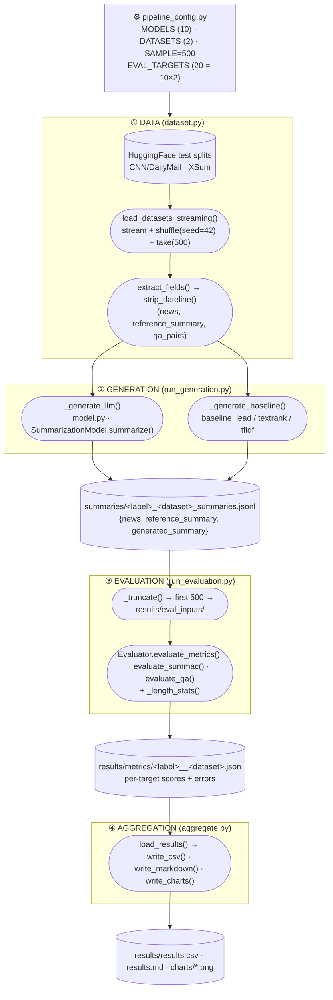

# Workflow & Architecture

End-to-end action flow of the summarization-evaluation pipeline: how the data is
loaded and cleaned, how it is fed to the models, what each stage produces, and
which functions own each transition. For *how to run* it on the cluster, see
[`PIPELINE.md`](PIPELINE.md).

---

## 1. Action flow (states → functions → states)

The pipeline is a chain of **states** (data artifacts on disk) connected by
**functions** (the code that transforms one artifact into the next).



SLURM runs ① is implicit (each task loads its own data), and ②→③→④ are four
dependency-chained job arrays — see [§5](#5-orchestration-slurm).

---

## 2. The data and its processing

**Source.** Two news-summarization benchmarks, pulled from the HuggingFace Hub
on first use (`dataset.py: DATASET_CONFIGS`):

| Dataset | HF path | Field (article) | Field (reference) |
|---------|---------|-----------------|-------------------|
| CNN/DailyMail (3.0.0) | `abisee/cnn_dailymail` | `article` | `highlights` |
| XSum | `EdinburghNLP/xsum` | `document` | `summary` |

**Processing** (`load_datasets_streaming`):
1. Open the **test** split in **streaming** mode (no full download to disk).
2. `shuffle(seed=42)` — fixed seed so every model scores the *same* 500 articles.
3. `take(SAMPLE)` — cap at 500 records per dataset.

**Per-record extraction** (`extract_fields`):
- Maps each dataset's column names to a common shape via `_FIELD_MAP`.
- For CNN/DailyMail, `strip_dateline()` removes leading datelines (e.g.
  `"LONDON (CNN) -- "`) so the model sees clean article text.
- Returns the tuple `(news_text, reference_summary, qa_pairs)` (`qa_pairs` is
  `None` for these two datasets).

---

## 3. How the data feeds the models

`run_generation.py` is one SLURM array task per model config
(`pipeline_config.MODELS[index]`). It loads the datasets once, then dispatches on
`spec.kind`:

**LLMs** (`_generate_llm` → `model.py`):
- `SummarizationModel.__init__` loads the tokenizer + causal LM
  (`trust_remote_code=False` → native `Phi3ForCausalLM` / `LlamaForCausalLM`),
  applying a 4-bit/8-bit `BitsAndBytesConfig` when requested.
- For each article, `summarize()` formats the prompt
  `"News: {news}\nSummarize the news in two sentences. Summary:"`, truncates to
  `max_input_length=2048`, and **greedy-decodes** (`do_sample=False`,
  `max_new_tokens=150`).

**Baselines** (`_generate_baseline`): non-neural extractive summarizers, all
emitting 2 sentences to match the LLM prompt — `Lead-1`/`Lead-3` (first n
sentences), `TextRank` (sumy graph ranking), `TFIDF` (sumy LSA).

**Output state** — one JSONL file per (model, dataset),
`summaries/<label>_<dataset>_summaries.jsonl`, each line:
```json
{"news": "...", "reference_summary": "...", "generated_summary": "..."}
```
Generation is **idempotent**: `_has_enough()` skips any file that already has
≥ `SAMPLE` lines, so committed full-test-set summaries are reused.

---

## 4. The output and how it is scored

`run_evaluation.py` is one SLURM array task per `EVAL_TARGETS[index]`
(model × dataset). It truncates the summary file to the first 500 records
(`_truncate` → `results/eval_inputs/`) and runs `evaluator.Evaluator`:

| Metric | Function | Compared against | Notes |
|--------|----------|------------------|-------|
| BLEU, ROUGE-L, METEOR, BERTScore-F1 | `evaluate_metrics` | reference summary | ROUGE-1/2 intentionally excluded |
| SummaC | `evaluate_summac` | **source article** | factual consistency (NLI) |
| QAFactEval | `evaluate_qa` | source article | optional; `null` if not installed |
| length / compression | `_length_stats` | — | descriptive stats |

Each metric group runs in its own `try/except`: a failure records an error
string and leaves that metric `null` instead of aborting the target.

**Output state** — `results/metrics/<label>__<dataset>.json`, e.g.:
```json
{"label": "Llama_8bit", "dataset": "cnn_dailymail", "num_samples": 500,
 "bleu": 0.063, "rougeL": 0.215, "meteor": 0.344,
 "bertscore_f1": 0.872, "summac": 0.026, "qa_eval": null,
 "avg_gen_len": 72.8, "avg_compression": 0.155, "errors": {...}}
```

`aggregate.py` then collects all 20 JSONs (`load_results`) and writes the final
artifacts: `results/results.csv` (`write_csv`), `results/results.md`
(`write_markdown` — comparison tables + best-per-metric + failure notes), and
`results/charts/*.png` (`write_charts` — per-metric grouped bars and
model×metric heatmaps). A single consolidated overview, `comparison.png`, is
produced separately by `make_comparison_chart.py` (run after aggregation).

---

## 5. Orchestration (SLURM)

`slurm/submit_all.sh` wires the four stages into a dependency chain so a single
`sbatch` storm runs the whole experiment, robust to individual task failures
(`afterany`, not `afterok`):

```
gen_baselines (CPU array 0-3) ┐
                              ├─ afterany ─► evaluate (GPU array 0-19) ─► aggregate (CPU)
gen_llms      (GPU array 4-9) ┘
```

`slurm/run_all.sh` is the one-command wrapper (pull → setup → submit).

| Stage | Script | Array | Driver function |
|-------|--------|-------|-----------------|
| Generate baselines | `slurm/gen_baselines.sbatch` | 0–3 | `run_generation.main` |
| Generate LLMs | `slurm/gen_llms.sbatch` | 4–9 | `run_generation.main` |
| Evaluate | `slurm/evaluate.sbatch` | 0–19 | `run_evaluation.main` |
| Aggregate | `slurm/aggregate.sbatch` | — | `aggregate.main` |

---

## 6. File map (active pipeline)

| File | Role |
|------|------|
| `pipeline_config.py` | Single source of truth: model matrix, datasets, sample size, target indexing |
| `dataset.py` | Load/stream datasets, strip datelines, extract common fields |
| `model.py` | `SummarizationModel` — load LLM (+quantization) and generate one summary |
| `baseline_lead.py` / `baseline_textrank.py` / `baseline_tfidf.py` | Non-neural extractive baselines |
| `run_generation.py` | One array task → summaries for one model config |
| `evaluator.py` | `Evaluator` — BLEU/ROUGE-L/METEOR/BERTScore/SummaC/QAFactEval |
| `run_evaluation.py` | One array task → metric JSON for one (model, dataset) |
| `aggregate.py` | Collect metric JSONs → CSV, Markdown, per-metric charts/heatmaps |
| `make_comparison_chart.py` | Single overview figure comparing all models across metrics |
| `slurm/*` | SLURM job scripts + submission/orchestration |

> Note: `main.py` and `analyze_summaries.py` are the earlier single-process
> prototype, kept for reference; the SLURM pipeline above supersedes them.
