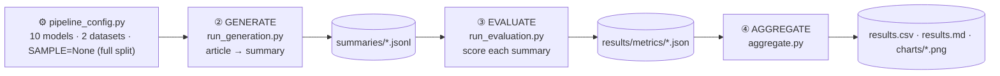

# Workflow & Architecture

This pipeline does two things, end to end:

1. **Generate** short summaries of news articles — with 6 LLM configs and 4 simple
   baselines.
2. **Evaluate** those summaries against the reference summary and the source
   article, then collect everything into one table of scores and charts.

---

## How to run it (cluster)

One command, from inside the repo on a **login node** (after VPN + SSH):

```bash
bash slurm/run_all.sh                 # pull latest code → set up env → submit everything
bash slurm/run_all.sh --skip-setup    # env already built (skip the slow install)
bash slurm/run_all.sh --skip-pull --skip-setup   # just submit, nothing else
```

> **Use `bash`, not `sbatch`, to launch.** `run_all.sh` and `submit_all.sh` are
> plain orchestration scripts that run on the login node. They call `sbatch`
> **for you**, once per stage. Only the `slurm/*.sbatch` files (the ones with
> `#SBATCH` headers) are ever submitted with `sbatch` — and the wrapper does that.

Track and find results:

```bash
watch -n 10 squeue --me                          # live job status
tail -f logs/sum-*_*.out                          # live logs
# results land in: results/results.md, results/results.csv, results/charts/
```

---

## The four stages



On SLURM the stages run as four dependency-chained jobs (see
[§6](#6-how-slurm-runs-it)).

---

## 1. Config — the single source of truth (`pipeline_config.py`)

Everything is driven from here:

| Setting | Value |
|---------|-------|
| **Models** | 4 baselines + 6 LLMs = **10 configs** |
| **Datasets** | CNN/DailyMail + XSum = **2** |
| **Eval targets** | 10 × 2 = **20** (one score file per model × dataset) |
| **`SAMPLE`** | `None` = **use the full test split**. Set an int (e.g. `500`) for a quick run. |

The 6 LLMs are Llama-3.2-3B and Phi-3-mini, each in 3 modes: `None` (fp16),
`4bit`, `8bit`. The 4 baselines are `Lead-1`, `Lead-3`, `TextRank`, `TFIDF`.

**To change how many articles are used, edit one line — `SAMPLE`.** It controls
both generation and evaluation. `None` means the whole split; an integer caps it.

---

## 2. Data (`dataset.py`)

Two news benchmarks, streamed from HuggingFace on first use (no full download):

| Dataset | HF path | Article field | Reference field | Full test split |
|---------|---------|---------------|-----------------|-----------------|
| CNN/DailyMail (3.0.0) | `abisee/cnn_dailymail` | `article` | `highlights` | 11,490 |
| XSum | `EdinburghNLP/xsum` | `document` | `summary` | 11,334 |

`load_datasets_streaming()`:
1. Opens the **test** split in **streaming** mode.
2. `shuffle(seed=42)` — fixed seed, so every model scores the *same* articles.
3. `take(SAMPLE)` — only if `SAMPLE` is an int; with `None` it keeps the full split.

`extract_fields()` then maps each dataset's columns to a common
`(news, reference_summary)` shape and, for CNN/DailyMail, strips the leading
dateline (e.g. `"LONDON (CNN) -- "`).

---

## 3. Generation (`run_generation.py`)

One SLURM task per model (`MODELS[index]`). It loads the datasets, then:

- **LLMs** (`model.py`): load the model (with 4-/8-bit quantization if asked),
  and for each article build the prompt
  `"News: {news}\nSummarize the news in two sentences. Summary:"`, then
  greedy-decode (`max_new_tokens=150`).
- **Baselines**: non-neural extractive summarizers, each emitting 2 sentences —
  `Lead-1/3` (first n sentences), `TextRank`, `TFIDF`.

**Output:** one file per (model, dataset),
`summaries/<label>_<dataset>_summaries.jsonl`, each line:

```json
{"news": "...", "reference_summary": "...", "generated_summary": "..."}
```

**Idempotent / resumable.** A summary file is considered done once it has the
dataset's full number of records (`target_count()` in the config). Already-complete
files are **skipped**, so committed full-split summaries are reused instead of
regenerated. (A partial file — e.g. a job that died halfway — is *not* skipped.)

---

## 4. Evaluation (`run_evaluation.py`)

One SLURM task per eval target (model × dataset). It scores the summary file
against the reference and the source article:

| Metric | Compared against | Note |
|--------|------------------|------|
| BLEU, ROUGE-L, METEOR, BERTScore-F1 | reference summary | ROUGE-1/2 excluded on purpose |
| SummaC | **source article** | factual consistency (NLI) |
| QAFactEval | source article | optional; `null` if not installed |
| length / compression | — | descriptive stats |

Each metric group runs in its own `try/except`: if one fails it records an error
and leaves that metric `null` instead of killing the whole target.

**Output:** `results/metrics/<label>__<dataset>.json`, e.g.:

```json
{"label": "Llama_8bit", "dataset": "cnn_dailymail", "num_samples": 11490,
 "bleu": 0.063, "rougeL": 0.215, "meteor": 0.344, "bertscore_f1": 0.872,
 "summac": 0.026, "qa_eval": null, "avg_gen_len": 72.8, "errors": {}}
```

---

## 5. Aggregation (`aggregate.py`)

Collects all 20 metric JSONs and writes the final artifacts:

- `results/results.csv` — every score in one table.
- `results/results.md` — comparison tables + best-per-metric + failure notes.
- `results/charts/*.png` — per-metric bar charts and model×metric heatmaps.

`make_comparison_chart.py` (run after aggregation) adds one overview figure,
`comparison.png`.

---

## 6. How SLURM runs it

`slurm/submit_all.sh` (called by `run_all.sh`) submits four stages and chains
them so one launch runs the whole experiment:

```
gen_baselines (CPU array 0-3) ┐
                              ├─ afterany ─► evaluate (GPU array 0-19) ─► aggregate (CPU)
gen_llms      (GPU array 4-9) ┘
```

`afterany` (not `afterok`) makes it robust: one failed task doesn't block the
rest, and the final report is built from whatever metrics succeeded.

| Stage | Script | Array | Hardware |
|-------|--------|-------|----------|
| Generate baselines | `slurm/gen_baselines.sbatch` | 0–3 | CPU |
| Generate LLMs | `slurm/gen_llms.sbatch` | 4–9 | 1 GPU each |
| Evaluate | `slurm/evaluate.sbatch` | 0–19 | 1 GPU each |
| Aggregate | `slurm/aggregate.sbatch` | — | CPU |

---

## 7. File map

| File | Role |
|------|------|
| `pipeline_config.py` | Single source of truth: models, datasets, **sample size**, target indexing |
| `dataset.py` | Stream datasets, strip datelines, extract common fields |
| `model.py` | `SummarizationModel` — load LLM (+quantization), generate one summary |
| `baseline_*.py` | Non-neural baselines (lead / textrank / tfidf) |
| `run_generation.py` | One task → summaries for one model |
| `evaluator.py` | The metrics: BLEU / ROUGE-L / METEOR / BERTScore / SummaC / QAFactEval |
| `run_evaluation.py` | One task → metric JSON for one (model, dataset) |
| `aggregate.py` | Collect metric JSONs → CSV, Markdown, charts |
| `make_comparison_chart.py` | One overview figure across all models |
| `slurm/*` | SLURM job scripts + the `bash` launch wrappers |

> Note: `main.py` is the earlier single-process prototype, kept for reference.
> The SLURM pipeline above supersedes it.
