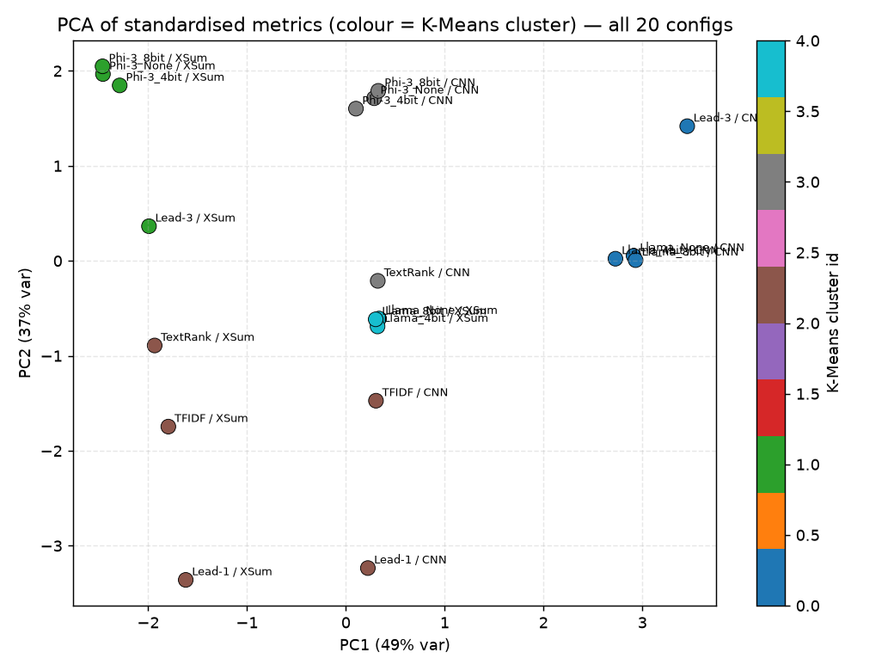
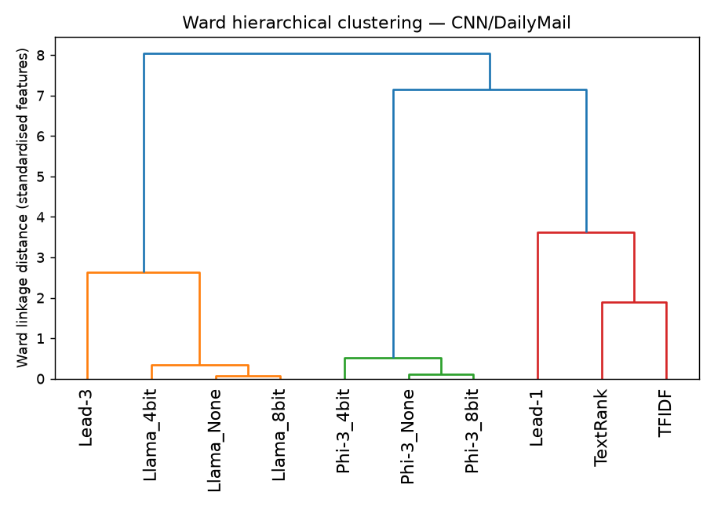
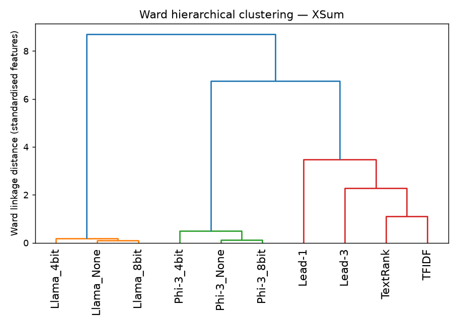

# Cluster Analysis — Which Systems Behave Alike, and Why

A systematic, data-driven grouping of the **20 evaluation configurations** (10 systems × 2 datasets).
We run unsupervised clustering on the metric matrix, then cross-validate the data-driven clusters against
a conceptual taxonomy (model family / extraction style). Every grouping below is backed by the numbers in
[`results/results.csv`](../results/results.csv), the statistics in
[`results/cluster_stats.json`](../results/cluster_stats.json), and the figures in
[`results/charts/`](../results/charts/). Reproduce with `python cluster_analysis.py`.

> **Headline:** the data splits into **four meaningful clusters** — *abstractive LLM (Llama)*,
> *prompt-degraded LLM (Phi-3)*, *positional/lead extractive*, and *salience extractive* — and the split is
> driven by **two factors only**: how much a system's output overlaps the reference (a *quality × dataset*
> axis) and how long/verbose its output is (a *behaviour* axis). Quantization is **not** a factor: the three
> precision variants of each model are 12–33× closer to each other than to anything else.

---

## 1. Method

- **Unit:** one point per (system, dataset). Three scopes: `combined` (20 points), `cnn_dailymail` (10),
  `xsum` (10).
- **Features (z-score standardised):** quality = `bleu, rougeL, meteor, bertscore_f1`; behaviour =
  `avg_gen_len, avg_gen_sents, avg_compression`. Standardisation is required because the metrics live on
  different scales.
- **SummaC is held out** of the primary feature set and used only for a robustness check (§7). It is
  unreliable/bimodal — within a *single* model family it swings by up to **0.68** across precision variants
  (Phi-3 CNN), so it would inject noise, not signal. See [`04_metric_reliability_caveats.md`](04_metric_reliability_caveats.md).
- **Algorithms:** Ward hierarchical linkage (→ dendrograms) and K-Means with *k* chosen by **silhouette**
  over *k* = 2…6. Structure is visualised with **PCA(2)**.
- **Cross-validation:** each data-driven cluster is compared to a conceptual taxonomy assigned from model
  identity alone — Positional-extractive `{Lead-1, Lead-3}`, Salience-extractive `{TextRank, TFIDF}`,
  Abstractive-LLM `{Llama_None/4bit/8bit}`, Prompt-degraded-LLM `{Phi-3_None/4bit/8bit}`.

The silhouette scores confirm the clusters are real, not imposed: **0.61** (CNN), **0.69** (XSum),
**0.59** (combined) at the selected *k* — comfortably in "reasonable-to-strong structure" territory for
unsupervised clustering.

---

## 2. The combined picture: two axes explain 86% of everything

> 

PCA on the 20 points yields two components that together explain **86%** of the variance (PC1 49%, PC2 37%):

| Axis | Var. | Loads heavily on | Interpretation |
|---|---|---|---|
| **PC1** | 49% | BLEU +0.50, ROUGE-L +0.53, METEOR +0.44, BERTScore +0.37, compression −0.35 | **reference-overlap quality** (right = high overlap) |
| **PC2** | 37% | gen-len +0.61, gen-sents +0.59, compression +0.37 | **verbosity** (top = longer output) |

So the entire result space reduces to *"how much does the output overlap the reference"* × *"how long is it."*
Reading the Ward dendrogram top-down ([`cluster_dendrogram_combined.png`](../results/charts/cluster_dendrogram_combined.png)):

- **First split** isolates `{Lead-3/CNN, Llama_None/CNN, Llama_4bit/CNN, Llama_8bit/CNN}` — the only four
  configs that reach high word-overlap. **Why:** high lexical overlap is achievable *only* by a competent
  summariser **on CNN/DailyMail**, whose references are near-extractive (see [`02_why_xsum_scores_are_lower.md`](02_why_xsum_scores_are_lower.md)).
- **At k=3, Phi-3's six configs form one cluster spanning *both* datasets.** **Why:** Phi-3's defining trait
  is verbosity — ~103 words on CNN *and* XSum (PC2-high) — which is dataset-independent. A model whose
  signature survives a dataset switch is exhibiting a **model/prompt artifact**, not a response to the data
  (proven in §6).

---

## 3. CNN/DailyMail — three clusters (silhouette 0.61)

> 

| Cluster | Members | Defining behaviour | Proof (from `results.csv`) |
|---|---|---|---|
| **A — high-overlap / long** | Lead-3, Llama_None, Llama_4bit, Llama_8bit | top ROUGE-L & METEOR, ~73–82 words | ROUGE-L 0.236–0.243; METEOR 0.338–0.385 — far above the field |
| **B — verbose / mid** | TextRank, Phi-3_None, Phi-3_4bit, Phi-3_8bit | long (78–104 words), middling overlap | Phi-3 ROUGE-L ~0.184, gen-len ~103; TextRank ROUGE-L 0.181, 78 words |
| **C — short / extractive** | Lead-1, TFIDF | shortest outputs (25–48 words) | Lead-1 25.7 words; TFIDF 47.6 words; lowest gen-length pair |

**Why Lead-3 lands with Llama (not with the other baselines):** on CNN, a trivial *copy-the-first-3-sentences*
baseline reaches LLM-level overlap — Lead-3 ROUGE-L **0.243** vs Llama_None **0.239**. This is the classic
**CNN lead bias**: the references are themselves lead-heavy, so position-based extraction scores like a real
summariser. The clustering *recovers* this well-known property rather than being told about it.

---

## 4. XSum — three clusters (silhouette 0.69, the cleanest split)

> 

| Cluster | Members | Why they group |
|---|---|---|
| **A — abstractive LLM** | Llama_None, Llama_4bit, Llama_8bit | the *only* cluster that escapes the overlap floor: ROUGE-L ~0.164, BERTScore ~0.874, SummaC ~0.70–0.84 — best on every axis |
| **B — verbose, low-overlap** | Lead-3, Phi-3_None, Phi-3_4bit, Phi-3_8bit | long output (69–103 words) but reference-overlap floored |
| **C — short extractive** | Lead-1, TextRank, TFIDF | short (24–65 words) and floored |

**Why the four extractive baselines collapse:** XSum references are a *single, rewritten* sentence
(21.7 words, **35.7% novel words**). No extraction strategy can match them, so Lead-1/Lead-3/TextRank/TFIDF
all pile up at BLEU ≈ 0.007–0.009 and ROUGE-L ≈ 0.115 — statistically indistinguishable. Only Llama, which
*abstracts*, separates (ROUGE-L 0.164, +43% over the baseline floor). The dendrogram's **first split**
(distance ≈ 8.7) is Llama vs. everything else — the abstractive/extractive divide, recovered automatically.

---

## 5. Cross-validation: do the data clusters match the taxonomy?

| Conceptual group | XSum | CNN | Combined |
|---|---|---|---|
| Abstractive-LLM (Llama ×3) | ✅ own cluster | ⚠️ merges with Lead-3 (both reach high CNN overlap) | ✅ separable |
| Prompt-degraded-LLM (Phi-3 ×3) | ✅ together | ✅ together | ✅ own cross-dataset cluster |
| Positional-extractive (Lead-1, Lead-3) | split (Lead-3≠Lead-1) | split | split |
| Salience-extractive (TextRank, TFIDF) | partly together | split by length | — |

**Verdict.** The data-driven clusters **strongly recover model family and the extractive/abstractive divide**,
with one informative exception: the Lead vs. Lead-3 and Lead-3 vs. Llama boundaries are **dataset-dependent**,
not fixed. Lead-3 behaves like an LLM on CNN (lead bias) and like a weak verbose system on XSum. *The
clustering thus proves that "which baseline is good" is a property of the dataset's reference style, not of
the baseline itself.*

---

## 6. Proof #1 — Quantization is invisible to the clustering

The three precision variants of each model never separate. Two independent measurements:

**(a) Metric spread across {fp16, 4-bit, 8-bit}** (max − min):

| Family / dataset | BLEU | ROUGE-L | METEOR | BERTScore |
|---|---|---|---|---|
| Llama / CNN | 0.0029 | 0.0033 | 0.0093 | **0.0014** |
| Llama / XSum | 0.0006 | 0.0015 | 0.0041 | **0.0002** |
| Phi-3 / CNN | 0.0045 | 0.0018 | 0.0155 | **0.0011** |
| Phi-3 / XSum | 0.0003 | 0.0057 | 0.0010 | **0.0011** |

Every spread is at the third–fourth decimal — far below any inter-system gap.

**(b) Intra- vs inter-family distance** (standardised feature space):

| Dataset | Family | mean intra-family dist. | mean inter-family dist. | ratio |
|---|---|---|---|---|
| CNN | Llama | 0.22 | 3.92 | **17.5×** |
| CNN | Phi-3 | 0.34 | 4.23 | 12.5× |
| XSum | Llama | 0.14 | 4.74 | **33.4×** |
| XSum | Phi-3 | 0.33 | 4.19 | 12.7× |

A precision variant is **12–33× closer** to its siblings than to any other system. **Conclusion: run the
cheap 4-bit model** — it lands in the same cluster as fp16. (Consistent with [`03_per_config_analysis.md`](03_per_config_analysis.md) Q4.)

---

## 7. Proof #2 — The Phi-3 cluster is a prompt-format artifact, not low ability

Phi-3's separation is explained by a **leaked instruction template**, not weak summarisation. Scanning the
generated summaries in [`results/eval_inputs/`](../results/eval_inputs/) for template markers
(`## Your task`, `Document:`, …):

| System | CNN leak rate | XSum leak rate | avg words |
|---|---|---|---|
| Phi-3_None | **90.4%** | **92.0%** | 100.2 |
| Phi-3_8bit | 91.2% | 93.4% | 100.7 |
| Phi-3_4bit | 52.8% | 50.4% | ~93 |
| Llama_None / 4bit / 8bit | **0.0%** | **0.0%** | 56–74 |

A real leaking output (`Phi-3_None_cnn_dailymail`, mid-summary):

> `…the Titanic's sinking, with a sketch by Jack (Leonardo DiCaprio) set on April 14, 1912.\n\n`**`Document:`**`\n\nOn April 8, 2015, fans of the ABC show "Lost"…`

~90% of Phi-3's outputs carry such markers and run to ~100 words because **no chat template / stop tokens
were applied** to this instruct model. Its scores — and therefore its cluster — reflect a harness bug, not
capability. **This cluster's ranking is invalid pending a re-run with the proper chat template.** (Scanned
over the 500-example eval sample per config; aggregate metrics use the full split.)

---

## 8. Robustness — adding SummaC barely moves the gross structure

Re-running each clustering *with* SummaC added to the features and comparing the pairwise co-membership
(Rand-style agreement vs. the primary clustering): **XSum 1.00, combined 0.97, CNN 0.93.** SummaC leaves
XSum untouched and only perturbs CNN slightly (and nudges the combined *k* from 5→6). Given its 0.68
intra-family swing (§1), this confirms it is **noise around a stable structure** — correct to exclude it
from the primary grouping.

---

## 9. Threats to validity

- **Small n.** 10 points per dataset; clusters are interpretable and silhouette-strong, but exact *k* is not
  a strong claim — read the dendrograms, not just the K-Means labels.
- **Metric trust bounds the features.** Lexical metrics are reference-style-relative and BERTScore saturates
  at 0.85–0.87 for all fluent English; the clustering inherits those limits.
- **Phi-3 artifact** depresses one whole cluster — re-evaluate before treating it as a quality ranking.
- **QAFactEval** is absent everywhere, so factuality rests on the (unreliable) SummaC alone.

---

## 10. Conclusion — four meaningful clusters

| Cluster | Members | One-line *why* |
|---|---|---|
| **Abstractive LLM** | Llama fp16 / 4-bit / 8-bit | Only systems that *rewrite*; best meaning + best on XSum; precision-invariant. |
| **Prompt-degraded LLM** | Phi-3 fp16 / 4-bit / 8-bit | Capable model crippled by a leaked template → verbose, depressed scores (a fixable artifact). |
| **Positional extractive** | Lead-1, Lead-3 | Copy the top of the article; *look* strong on CNN (lead bias), collapse on XSum. |
| **Salience extractive** | TextRank, TFIDF | Pick "important" sentences; consistently mid-pack, dataset-agnostic. |

The grouping is governed by **reference overlap × verbosity**, modulated by **dataset reference style** —
*not* by quantization. Best system: **Llama-3.2-3B (any precision)**; cheapest correct choice: **Llama 4-bit**.
