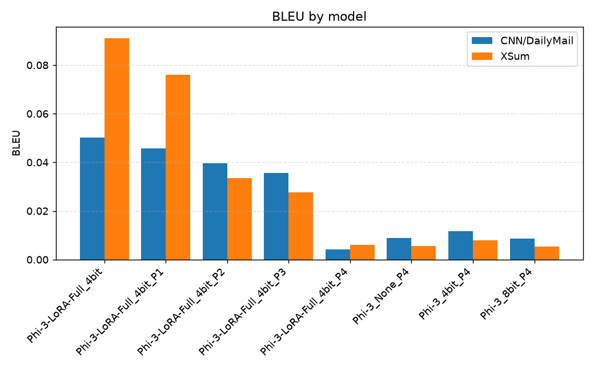
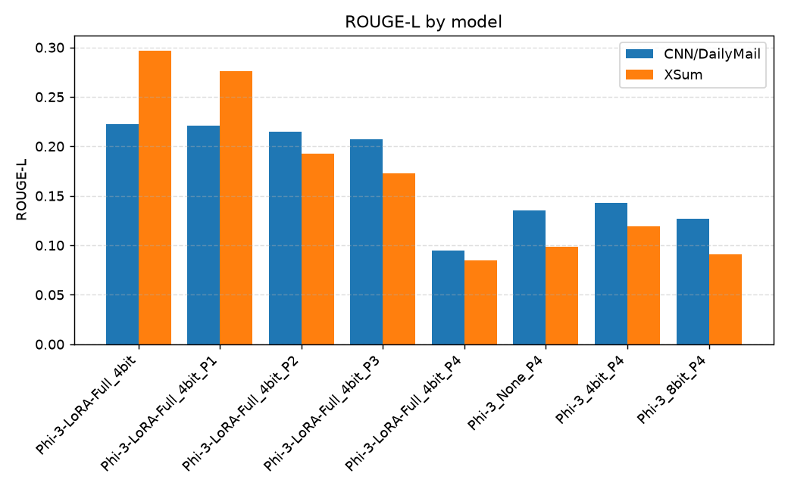
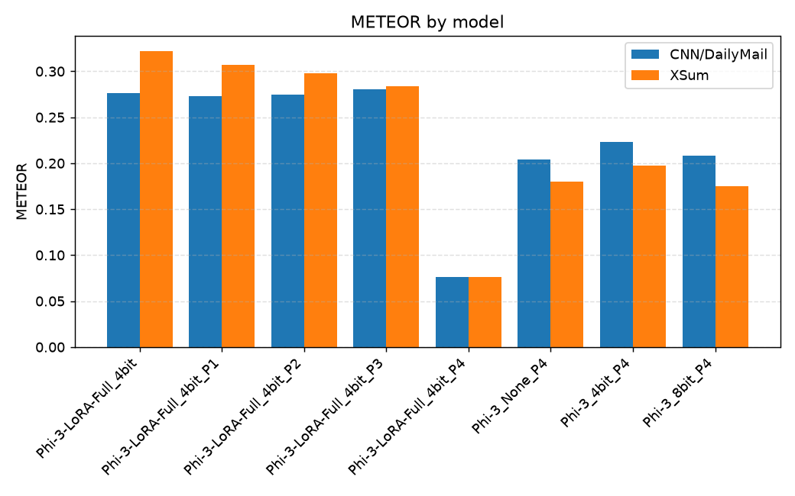
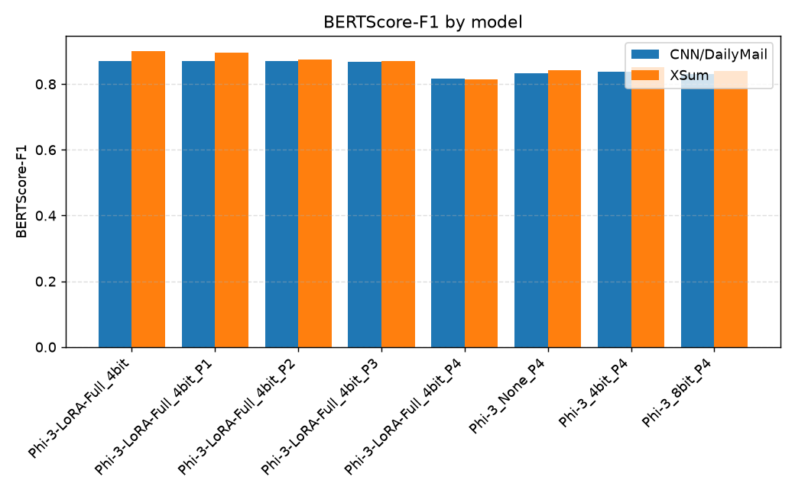
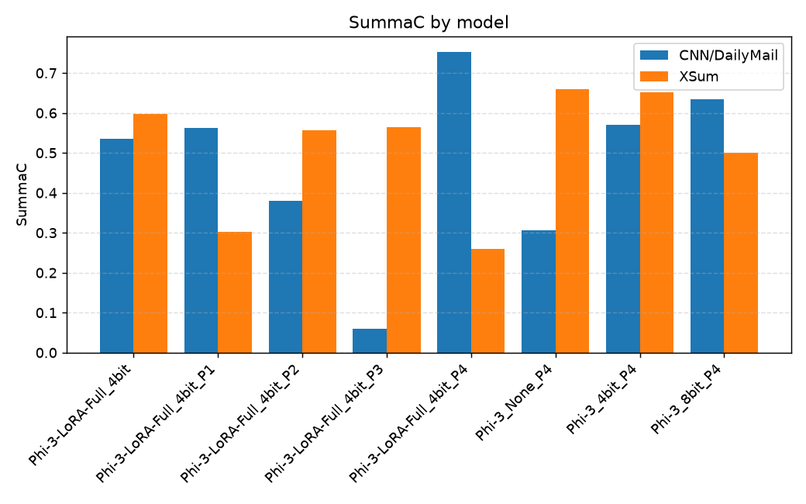
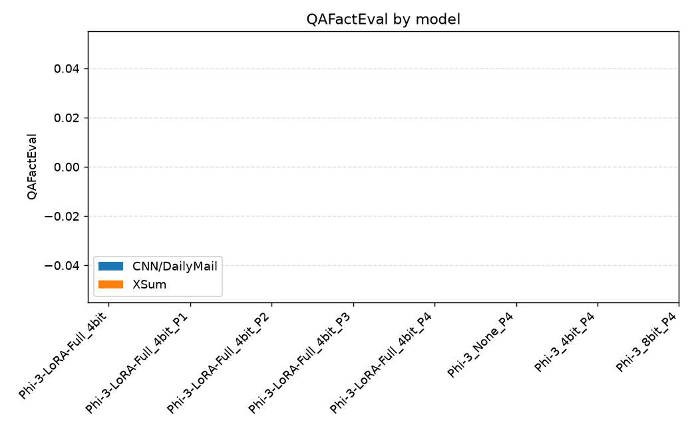
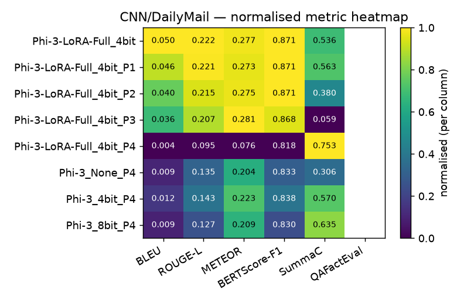
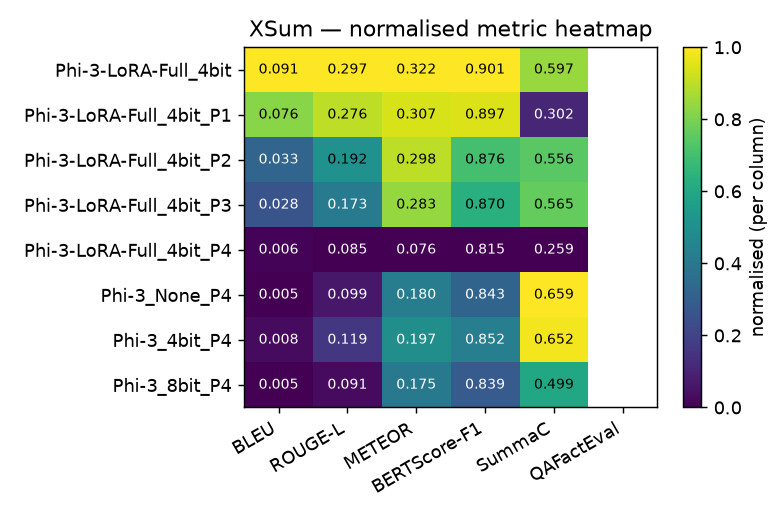

# Summarization Experiment Results

**Models**: 8 &nbsp;|&nbsp; **Datasets**: CNN/DailyMail, XSum &nbsp;|&nbsp; **Samples/dataset**: None

**Metrics**: BLEU, ROUGE-L, METEOR, BERTScore-F1, SummaC, QAFactEval (ROUGE-1 / ROUGE-2 excluded). Higher is better for all.

---

## CNN/DailyMail

| Model | BLEU | ROUGE-L | METEOR | BERTScore-F1 | SummaC | QAFactEval | Gen Len | Compression |
|-------|------:|------:|------:|------:|------:|------:|--------:|------------:|
| Phi-3-LoRA-Full_4bit | 0.0503 | 0.2222 | 0.2767 | 0.8706 ± 0.0189 | 0.5355 ± 0.0507 | — | 51.2 | 0.0895 |
| Phi-3-LoRA-Full_4bit_P1 | 0.0458 | 0.2213 | 0.2729 | 0.8706 ± 0.0199 | 0.5630 ± 0.0423 | — | 57.4 | 0.0908 |
| Phi-3-LoRA-Full_4bit_P2 | 0.0396 | 0.2148 | 0.2746 | 0.8707 ± 0.0193 | 0.3798 ± 0.1059 | — | 60.3 | 0.0982 |
| Phi-3-LoRA-Full_4bit_P3 | 0.0356 | 0.2074 | 0.2807 | 0.8680 ± 0.0191 | 0.0592 ± 0.0542 | — | 67.9 | 0.1119 |
| Phi-3-LoRA-Full_4bit_P4 | 0.0042 | 0.0946 | 0.0759 | 0.8176 ± 0.0370 | 0.7534 ± 0.3479 | — | 18.1 | 0.0327 |
| Phi-3_None_P4 | 0.0089 | 0.1353 | 0.2041 | 0.8334 ± 0.0249 | 0.3057 ± 0.0913 | — | 109.3 | 0.1849 |
| Phi-3_4bit_P4 | 0.0116 | 0.1431 | 0.2235 | 0.8381 ± 0.0200 | 0.5702 ± 0.1104 | — | 110.1 | 0.2003 |
| Phi-3_8bit_P4 | 0.0085 | 0.1268 | 0.2086 | 0.8304 ± 0.0234 | 0.6350 ± 0.1069 | — | 127.4 | 0.2294 |

**Best per metric:** BLEU: **Phi-3-LoRA-Full_4bit** (0.0503); ROUGE-L: **Phi-3-LoRA-Full_4bit** (0.2222); METEOR: **Phi-3-LoRA-Full_4bit_P3** (0.2807); BERTScore-F1: **Phi-3-LoRA-Full_4bit_P2** (0.8707); SummaC: **Phi-3-LoRA-Full_4bit_P4** (0.7534)

---

## XSum

| Model | BLEU | ROUGE-L | METEOR | BERTScore-F1 | SummaC | QAFactEval | Gen Len | Compression |
|-------|------:|------:|------:|------:|------:|------:|--------:|------------:|
| Phi-3-LoRA-Full_4bit | 0.0911 | 0.2969 | 0.3222 | 0.9010 ± 0.0283 | 0.5969 ± 0.0857 | — | 20.3 | 0.0918 |
| Phi-3-LoRA-Full_4bit_P1 | 0.0759 | 0.2761 | 0.3073 | 0.8966 ± 0.0290 | 0.3020 ± 0.1261 | — | 23.1 | 0.0965 |
| Phi-3-LoRA-Full_4bit_P2 | 0.0335 | 0.1923 | 0.2978 | 0.8756 ± 0.0248 | 0.5561 ± 0.0127 | — | 55.2 | 0.2422 |
| Phi-3-LoRA-Full_4bit_P3 | 0.0276 | 0.1727 | 0.2833 | 0.8696 ± 0.0241 | 0.5649 ± 0.0781 | — | 64.8 | 0.2965 |
| Phi-3-LoRA-Full_4bit_P4 | 0.0062 | 0.0848 | 0.0759 | 0.8148 ± 0.0313 | 0.2587 ± 0.0205 | — | 14.8 | 0.0587 |
| Phi-3_None_P4 | 0.0055 | 0.0986 | 0.1797 | 0.8425 ± 0.0243 | 0.6590 ± 0.0819 | — | 114.3 | 0.5169 |
| Phi-3_4bit_P4 | 0.0078 | 0.1189 | 0.1972 | 0.8516 ± 0.0231 | 0.6518 ± 0.0768 | — | 88.3 | 0.4093 |
| Phi-3_8bit_P4 | 0.0054 | 0.0910 | 0.1751 | 0.8394 ± 0.0229 | 0.4994 ± 0.0537 | — | 127.4 | 0.5953 |

**Best per metric:** BLEU: **Phi-3-LoRA-Full_4bit** (0.0911); ROUGE-L: **Phi-3-LoRA-Full_4bit** (0.2969); METEOR: **Phi-3-LoRA-Full_4bit** (0.3222); BERTScore-F1: **Phi-3-LoRA-Full_4bit** (0.9010); SummaC: **Phi-3_None_P4** (0.6590)

---

## Notes — metrics that did not run

- `Phi-3-LoRA-Full_4bit_P1` / CNN/DailyMail — **qa_eval**: qafacteval not installed
- `Phi-3-LoRA-Full_4bit_P1` / XSum — **qa_eval**: qafacteval not installed
- `Phi-3-LoRA-Full_4bit_P2` / CNN/DailyMail — **qa_eval**: qafacteval not installed
- `Phi-3-LoRA-Full_4bit_P2` / XSum — **qa_eval**: qafacteval not installed
- `Phi-3-LoRA-Full_4bit_P3` / CNN/DailyMail — **qa_eval**: qafacteval not installed
- `Phi-3-LoRA-Full_4bit_P3` / XSum — **qa_eval**: qafacteval not installed
- `Phi-3-LoRA-Full_4bit_P4` / CNN/DailyMail — **qa_eval**: qafacteval not installed
- `Phi-3-LoRA-Full_4bit_P4` / XSum — **qa_eval**: qafacteval not installed
- `Phi-3-LoRA-Full_4bit` / CNN/DailyMail — **qa_eval**: qafacteval not installed
- `Phi-3-LoRA-Full_4bit` / XSum — **qa_eval**: qafacteval not installed
- `Phi-3_4bit_P4` / CNN/DailyMail — **qa_eval**: qafacteval not installed
- `Phi-3_4bit_P4` / XSum — **qa_eval**: qafacteval not installed
- `Phi-3_8bit_P4` / CNN/DailyMail — **qa_eval**: qafacteval not installed
- `Phi-3_8bit_P4` / XSum — **qa_eval**: qafacteval not installed
- `Phi-3_None_P4` / CNN/DailyMail — **qa_eval**: qafacteval not installed
- `Phi-3_None_P4` / XSum — **qa_eval**: qafacteval not installed

## Charts

