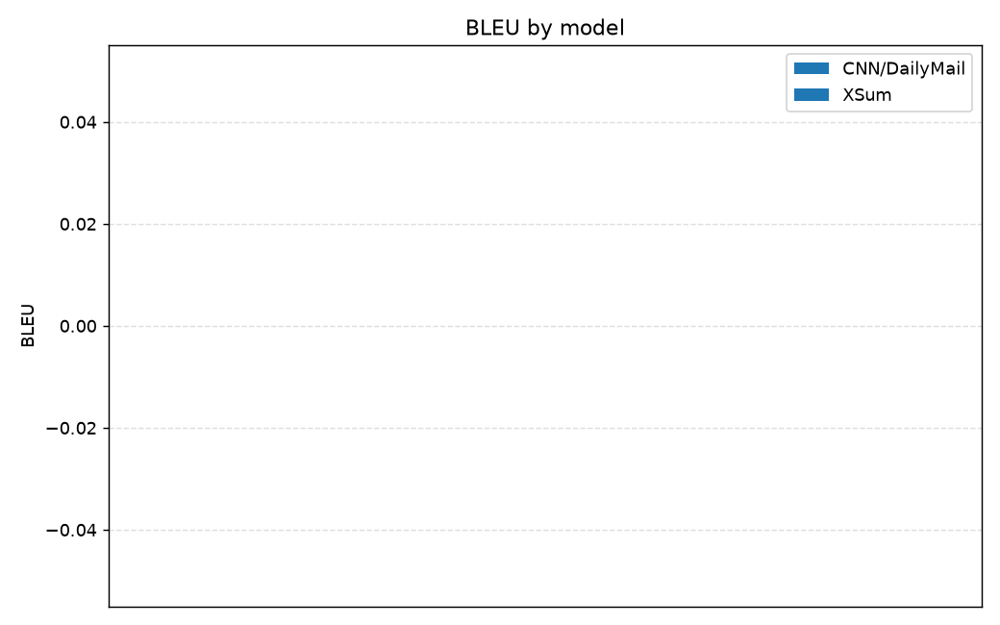
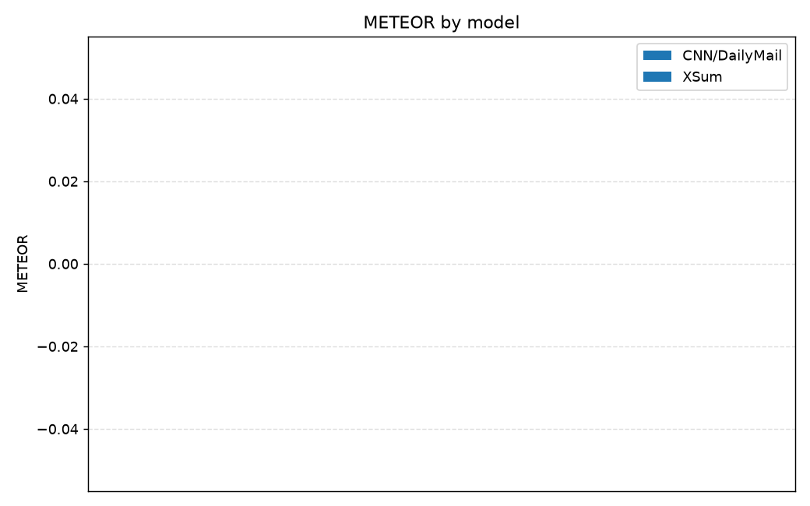
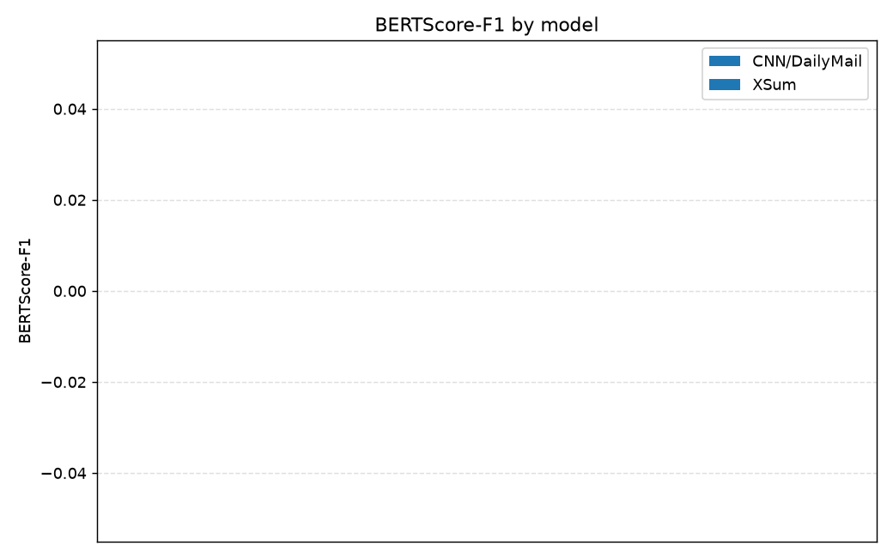
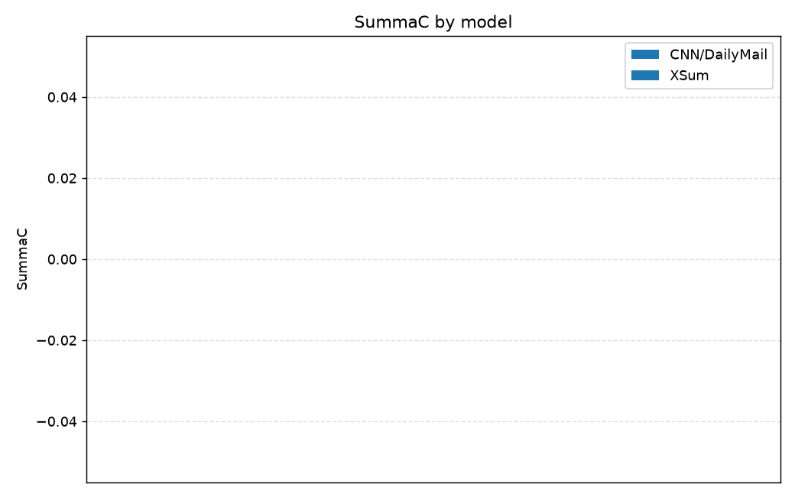
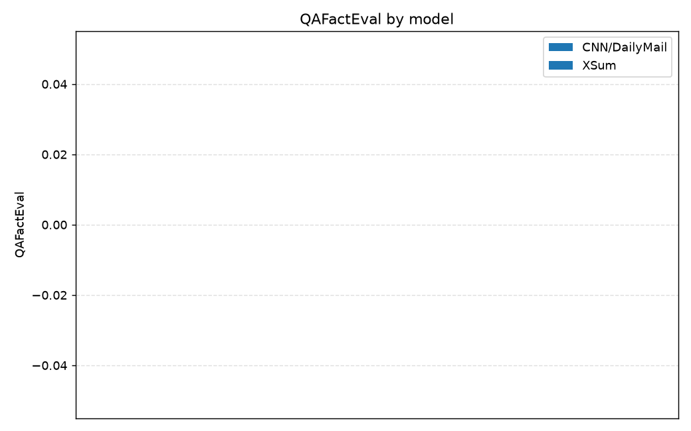

# Summarization Experiment Results

**Models**: 1 &nbsp;|&nbsp; **Datasets**: CNN/DailyMail, XSum &nbsp;|&nbsp; **Samples/dataset**: None

**Metrics**: BLEU, ROUGE-L, METEOR, BERTScore-F1, SummaC, QAFactEval (ROUGE-1 / ROUGE-2 excluded). Higher is better for all.

---

## CNN/DailyMail

| Model | BLEU | ROUGE-L | METEOR | BERTScore-F1 | SummaC | QAFactEval | Gen Len | Compression |
|-------|------:|------:|------:|------:|------:|------:|--------:|------------:|
| Transformer | 0.0050 | 0.1033 | 0.0851 | 0.8008 ± 0.0168 | 0.5604 ± 0.2148 | — | 45.3 | 0.0868 |

**Best per metric:** BLEU: **Transformer** (0.0050); ROUGE-L: **Transformer** (0.1033); METEOR: **Transformer** (0.0851); BERTScore-F1: **Transformer** (0.8008); SummaC: **Transformer** (0.5604)

---

## XSum

| Model | BLEU | ROUGE-L | METEOR | BERTScore-F1 | SummaC | QAFactEval | Gen Len | Compression |
|-------|------:|------:|------:|------:|------:|------:|--------:|------------:|
| Transformer | 0.0140 | 0.1430 | 0.1383 | 0.8482 ± 0.0225 | 0.3685 ± 0.0812 | — | 23.9 | 0.1110 |

**Best per metric:** BLEU: **Transformer** (0.0140); ROUGE-L: **Transformer** (0.1430); METEOR: **Transformer** (0.1383); BERTScore-F1: **Transformer** (0.8482); SummaC: **Transformer** (0.3685)

---

## Notes — metrics that did not run

- `Transformer` / CNN/DailyMail — **qa_eval**: qafacteval not installed
- `Transformer` / XSum — **qa_eval**: qafacteval not installed

## Charts

