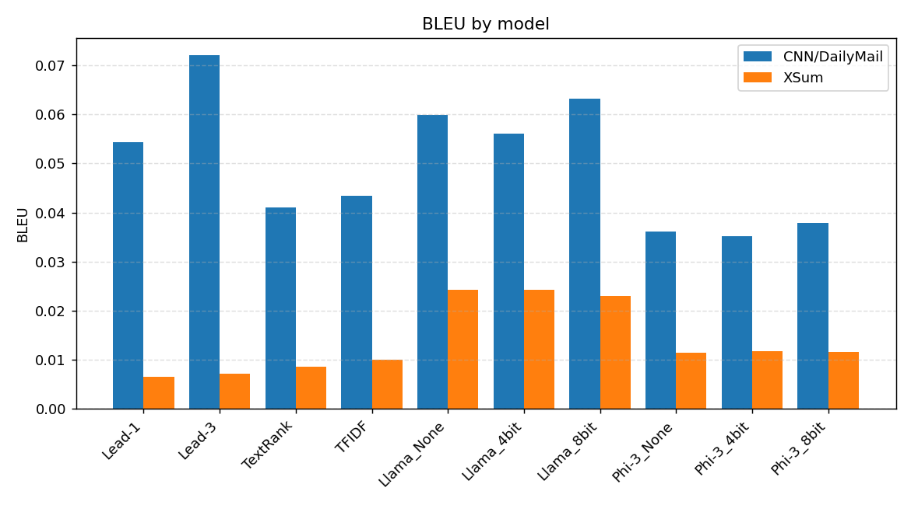
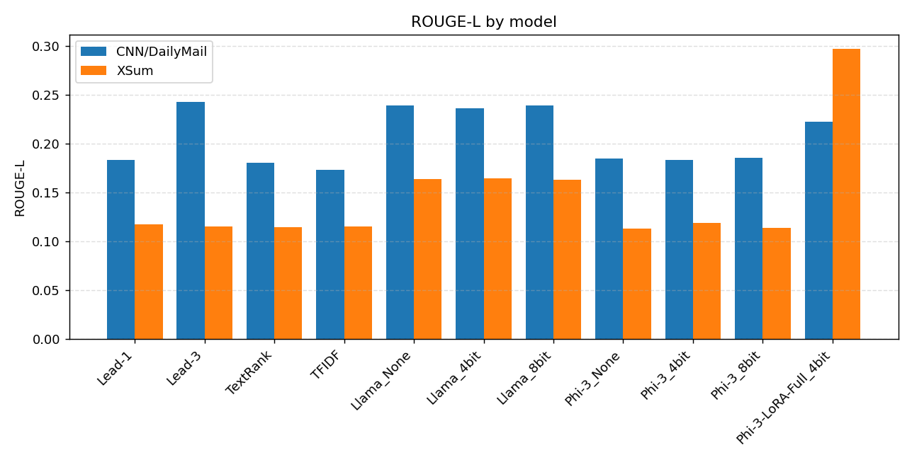
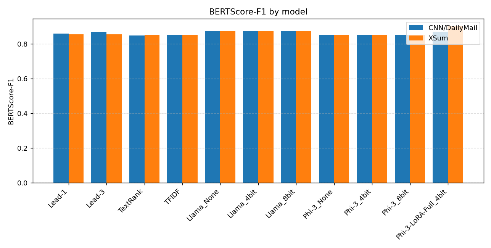
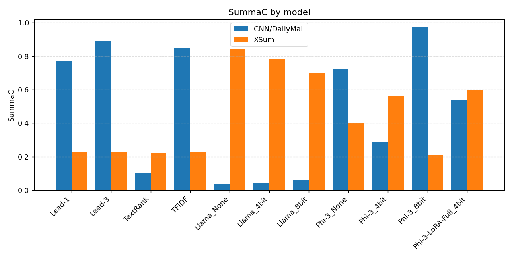
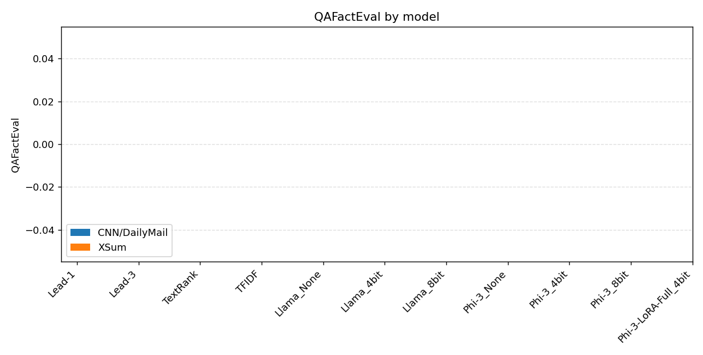
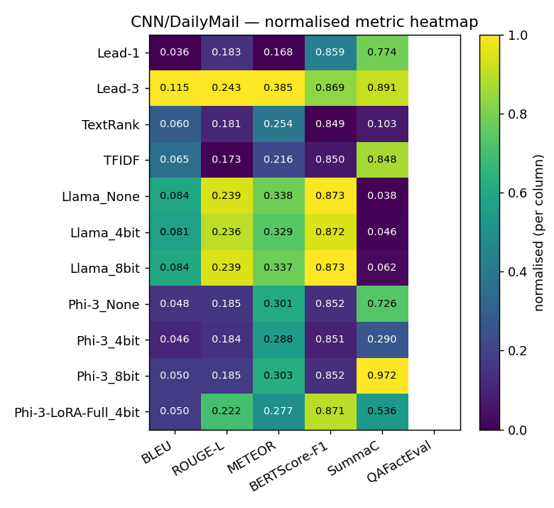
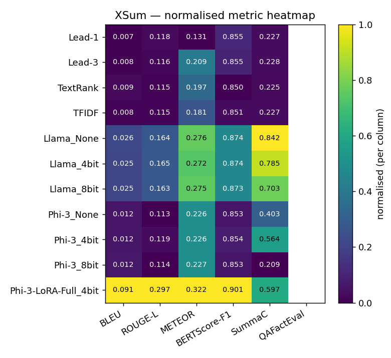

# Summarization Experiment Results

**Models**: 10 &nbsp;|&nbsp; **Datasets**: CNN/DailyMail, XSum &nbsp;|&nbsp; **Samples/dataset**: None

**Metrics**: BLEU, ROUGE-L, METEOR, BERTScore-F1, SummaC, QAFactEval. Higher is better for all.

---

## CNN/DailyMail

| Model | BLEU | ROUGE-L | METEOR | BERTScore-F1 | SummaC | QAFactEval | Gen Len | Compression |
|-------|------:|------:|------:|------:|------:|------:|--------:|------------:|
| Lead-1 | 0.0365 | 0.1831 | 0.1682 | 0.8593 ± 0.0237 | 0.7739 ± 0.1435 | — | 25.7 | 0.0475 |
| Lead-3 | 0.1150 | 0.2428 | 0.3854 | 0.8691 ± 0.0223 | 0.8914 ± 0.0661 | — | 82.2 | 0.1529 |
| TextRank | 0.0597 | 0.1808 | 0.2540 | 0.8488 ± 0.0218 | 0.1034 ± 0.0901 | — | 78.3 | 0.1394 |
| TFIDF | 0.0648 | 0.1733 | 0.2163 | 0.8504 ± 0.0223 | 0.8476 ± 0.0475 | — | 47.6 | 0.0881 |
| Llama_None | 0.0836 | 0.2389 | 0.3381 | 0.8729 ± 0.0192 | 0.0375 ± 0.0440 | — | 73.4 | 0.1319 |
| Llama_4bit | 0.0813 | 0.2359 | 0.3289 | 0.8717 ± 0.0198 | 0.0461 ± 0.0551 | — | 71.7 | 0.1285 |
| Llama_8bit | 0.0842 | 0.2392 | 0.3373 | 0.8731 ± 0.0191 | 0.0618 ± 0.0951 | — | 72.6 | 0.1309 |
| Phi-3_None | 0.0485 | 0.1846 | 0.3008 | 0.8521 ± 0.0180 | 0.7257 ± 0.1288 | — | 103.0 | 0.1959 |
| Phi-3_4bit | 0.0455 | 0.1836 | 0.2880 | 0.8510 ± 0.0191 | 0.2898 ± 0.1241 | — | 98.4 | 0.1882 |
| Phi-3_8bit | 0.0500 | 0.1854 | 0.3035 | 0.8521 ± 0.0180 | 0.9718 ± 0.0505 | — | 103.9 | 0.1972 |

**Best per metric:** BLEU: **Lead-3** (0.1150); ROUGE-L: **Lead-3** (0.2428); METEOR: **Lead-3** (0.3854); BERTScore-F1: **Llama_8bit** (0.8731); SummaC: **Phi-3_8bit** (0.9718)

---

## XSum

| Model | BLEU | ROUGE-L | METEOR | BERTScore-F1 | SummaC | QAFactEval | Gen Len | Compression |
|-------|------:|------:|------:|------:|------:|------:|--------:|------------:|
| Lead-1 | 0.0070 | 0.1178 | 0.1312 | 0.8554 ± 0.0199 | 0.2265 ± 0.1271 | — | 24.3 | 0.1124 |
| Lead-3 | 0.0077 | 0.1155 | 0.2089 | 0.8546 ± 0.0184 | 0.2276 ± 0.1265 | — | 69.4 | 0.3024 |
| TextRank | 0.0092 | 0.1147 | 0.1974 | 0.8497 ± 0.0188 | 0.2245 ± 0.1275 | — | 65.0 | 0.2605 |
| TFIDF | 0.0080 | 0.1151 | 0.1812 | 0.8513 ± 0.0189 | 0.2267 ± 0.1273 | — | 44.2 | 0.1946 |
| Llama_None | 0.0256 | 0.1639 | 0.2762 | 0.8736 ± 0.0196 | 0.8417 ± 0.1240 | — | 60.4 | 0.2664 |
| Llama_4bit | 0.0251 | 0.1646 | 0.2721 | 0.8735 ± 0.0200 | 0.7845 ± 0.1217 | — | 57.7 | 0.2606 |
| Llama_8bit | 0.0250 | 0.1631 | 0.2751 | 0.8734 ± 0.0195 | 0.7028 ± 0.1013 | — | 60.3 | 0.2665 |
| Phi-3_None | 0.0121 | 0.1131 | 0.2257 | 0.8527 ± 0.0161 | 0.4035 ± 0.0456 | — | 102.9 | 0.4815 |
| Phi-3_4bit | 0.0122 | 0.1189 | 0.2261 | 0.8537 ± 0.0178 | 0.5644 ± 0.1354 | — | 97.3 | 0.4564 |
| Phi-3_8bit | 0.0124 | 0.1136 | 0.2267 | 0.8526 ± 0.0164 | 0.2091 ± 0.1645 | — | 103.3 | 0.4837 |

**Best per metric:** BLEU: **Llama_None** (0.0256); ROUGE-L: **Llama_4bit** (0.1646); METEOR: **Llama_None** (0.2762); BERTScore-F1: **Llama_None** (0.8736); SummaC: **Llama_None** (0.8417)

---

## Notes — metrics that did not run

- `Lead-1` / CNN/DailyMail — **qa_eval**: qafacteval not installed
- `Lead-1` / XSum — **qa_eval**: qafacteval not installed
- `Lead-3` / CNN/DailyMail — **qa_eval**: qafacteval not installed
- `Lead-3` / XSum — **qa_eval**: qafacteval not installed
- `Llama_4bit` / CNN/DailyMail — **qa_eval**: qafacteval not installed
- `Llama_4bit` / XSum — **qa_eval**: qafacteval not installed
- `Llama_8bit` / CNN/DailyMail — **qa_eval**: qafacteval not installed
- `Llama_8bit` / XSum — **qa_eval**: qafacteval not installed
- `Llama_None` / CNN/DailyMail — **qa_eval**: qafacteval not installed
- `Llama_None` / XSum — **qa_eval**: qafacteval not installed
- `Phi-3_4bit` / CNN/DailyMail — **qa_eval**: qafacteval not installed
- `Phi-3_4bit` / XSum — **qa_eval**: qafacteval not installed
- `Phi-3_8bit` / CNN/DailyMail — **qa_eval**: qafacteval not installed
- `Phi-3_8bit` / XSum — **qa_eval**: qafacteval not installed
- `Phi-3_None` / CNN/DailyMail — **qa_eval**: qafacteval not installed
- `Phi-3_None` / XSum — **qa_eval**: qafacteval not installed
- `TFIDF` / CNN/DailyMail — **qa_eval**: qafacteval not installed
- `TFIDF` / XSum — **qa_eval**: qafacteval not installed
- `TextRank` / CNN/DailyMail — **qa_eval**: qafacteval not installed
- `TextRank` / XSum — **qa_eval**: qafacteval not installed

## Charts

