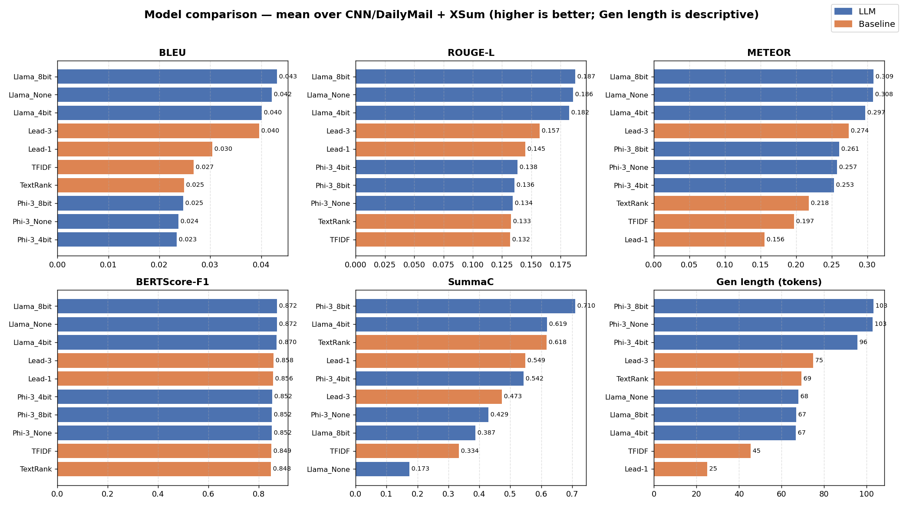

# Summarization Experiment Results

**Models**: 10 &nbsp;|&nbsp; **Datasets**: CNN/DailyMail, XSum &nbsp;|&nbsp; **Samples/dataset**: 500

**Metrics**: BLEU, ROUGE-L, METEOR, BERTScore-F1, SummaC, QAFactEval (ROUGE-1 / ROUGE-2 excluded). Higher is better for all.

---

## CNN/DailyMail

| Model | BLEU | ROUGE-L | METEOR | BERTScore-F1 | SummaC | QAFactEval | Gen Len | Compression |
|-------|------:|------:|------:|------:|------:|------:|--------:|------------:|
| Lead-1 | 0.0543 | 0.1707 | 0.1805 | 0.8570 ± 0.0242 | 0.2681 ± 0.0606 | — | 25.1 | 0.0552 |
| Lead-3 | 0.0720 | 0.1998 | 0.3398 | 0.8602 ± 0.0222 | 0.5463 ± 0.1338 | — | 78.2 | 0.1728 |
| TextRank | 0.0410 | 0.1540 | 0.2440 | 0.8472 ± 0.0192 | 0.9269 ± 0.1011 | — | 73.2 | 0.1569 |
| TFIDF | 0.0434 | 0.1477 | 0.2148 | 0.8476 ± 0.0223 | 0.3103 ± 0.0385 | — | 47.1 | 0.1059 |
| Llama_None | 0.0599 | 0.2100 | 0.3421 | 0.8704 ± 0.0199 | 0.0463 ± 0.0570 | — | 75.5 | 0.1590 |
| Llama_4bit | 0.0561 | 0.2038 | 0.3278 | 0.8685 ± 0.0201 | 0.9796 ± 0.0394 | — | 75.6 | 0.1583 |
| Llama_8bit | 0.0632 | 0.2150 | 0.3441 | 0.8716 ± 0.0194 | 0.0258 ± 0.0484 | — | 72.8 | 0.1553 |
| Phi-3_None | 0.0361 | 0.1574 | 0.2962 | 0.8519 ± 0.0164 | 0.2739 ± 0.0968 | — | 102.6 | 0.2341 |
| Phi-3_4bit | 0.0352 | 0.1608 | 0.2858 | 0.8518 ± 0.0187 | 0.4541 ± 0.1825 | — | 94.6 | 0.2177 |
| Phi-3_8bit | 0.0378 | 0.1603 | 0.3015 | 0.8520 ± 0.0170 | 0.6645 ± 0.2003 | — | 103.1 | 0.2348 |

**Best per metric:** BLEU: **Lead-3** (0.0720); ROUGE-L: **Llama_8bit** (0.2150); METEOR: **Llama_8bit** (0.3441); BERTScore-F1: **Llama_8bit** (0.8716); SummaC: **Llama_4bit** (0.9796)

---

## XSum

| Model | BLEU | ROUGE-L | METEOR | BERTScore-F1 | SummaC | QAFactEval | Gen Len | Compression |
|-------|------:|------:|------:|------:|------:|------:|--------:|------------:|
| Lead-1 | 0.0066 | 0.1188 | 0.1309 | 0.8559 ± 0.0176 | 0.8297 ± 0.1119 | — | 25.2 | 0.1068 |
| Lead-3 | 0.0072 | 0.1142 | 0.2081 | 0.8549 ± 0.0156 | 0.4002 ± 0.0444 | — | 71.7 | 0.3015 |
| TextRank | 0.0086 | 0.1115 | 0.1915 | 0.8492 ± 0.0158 | 0.3083 ± 0.1369 | — | 65.6 | 0.2527 |
| TFIDF | 0.0101 | 0.1164 | 0.1798 | 0.8513 ± 0.0167 | 0.3579 ± 0.1123 | — | 43.7 | 0.1825 |
| Llama_None | 0.0243 | 0.1612 | 0.2735 | 0.8732 ± 0.0189 | 0.3004 ± 0.0103 | — | 60.3 | 0.2473 |
| Llama_4bit | 0.0242 | 0.1609 | 0.2665 | 0.8723 ± 0.0201 | 0.2585 ± 0.0060 | — | 57.9 | 0.2381 |
| Llama_8bit | 0.0230 | 0.1599 | 0.2733 | 0.8725 ± 0.0194 | 0.7481 ± 0.1240 | — | 60.9 | 0.2498 |
| Phi-3_None | 0.0114 | 0.1104 | 0.2187 | 0.8519 ± 0.0159 | 0.5839 ± 0.0994 | — | 102.8 | 0.4489 |
| Phi-3_4bit | 0.0117 | 0.1156 | 0.2203 | 0.8524 ± 0.0179 | 0.6306 ± 0.1077 | — | 96.9 | 0.4236 |
| Phi-3_8bit | 0.0115 | 0.1109 | 0.2201 | 0.8522 ± 0.0162 | 0.7554 ± 0.1224 | — | 103.3 | 0.4517 |

**Best per metric:** BLEU: **Llama_None** (0.0243); ROUGE-L: **Llama_None** (0.1612); METEOR: **Llama_None** (0.2735); BERTScore-F1: **Llama_None** (0.8732); SummaC: **Lead-1** (0.8297)

---

## Notes — metrics that did not run

- `Lead-1` / CNN/DailyMail — **qa_eval**: qafacteval not installed
- `Lead-1` / XSum — **qa_eval**: qafacteval not installed
- `Lead-3` / CNN/DailyMail — **qa_eval**: qafacteval not installed
- `Lead-3` / XSum — **qa_eval**: qafacteval not installed
- `Llama_4bit` / CNN/DailyMail — **qa_eval**: qafacteval not installed
- `Llama_4bit` / XSum — **qa_eval**: qafacteval not installed
- `Llama_8bit` / CNN/DailyMail — **qa_eval**: qafacteval not installed
- `Llama_8bit` / XSum — **qa_eval**: qafacteval not installed
- `Llama_None` / CNN/DailyMail — **qa_eval**: qafacteval not installed
- `Llama_None` / XSum — **qa_eval**: qafacteval not installed
- `Phi-3_4bit` / CNN/DailyMail — **qa_eval**: qafacteval not installed
- `Phi-3_4bit` / XSum — **qa_eval**: qafacteval not installed
- `Phi-3_8bit` / CNN/DailyMail — **qa_eval**: qafacteval not installed
- `Phi-3_8bit` / XSum — **qa_eval**: qafacteval not installed
- `Phi-3_None` / CNN/DailyMail — **qa_eval**: qafacteval not installed
- `Phi-3_None` / XSum — **qa_eval**: qafacteval not installed
- `TFIDF` / CNN/DailyMail — **qa_eval**: qafacteval not installed
- `TFIDF` / XSum — **qa_eval**: qafacteval not installed
- `TextRank` / CNN/DailyMail — **qa_eval**: qafacteval not installed
- `TextRank` / XSum — **qa_eval**: qafacteval not installed

## Charts

### Overview — all models compared

### Per-metric

